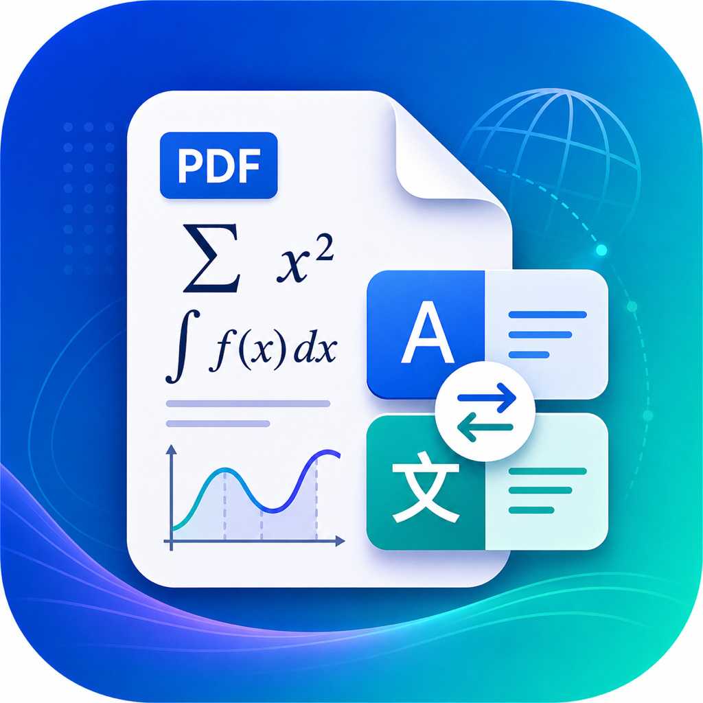
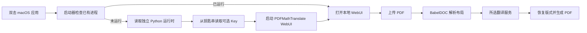

<p align="center">
  
</p>

# PDF 双语翻译 for macOS

把 PDFMathTranslate 2.0 和 BabelDOC 的版式保留翻译能力封装成一个可双击安装的 macOS 应用。

[](https://github.com/Rhiks/pdf-bilingual-translator-macos/releases/latest)

[](LICENSE)

> [!IMPORTANT]
> 当前发布包面向 Apple Silicon Mac，要求 macOS 12 或更高版本。应用使用本地 WebUI，但翻译内容会发送给你选择的模型服务商；使用 Ollama 才是完全本地翻译。Release 不包含任何 API Key。

这是一个第三方 macOS 打包项目，不是 PDFMathTranslate 官方发行版。PDF 解析、布局识别、翻译编排和输出由 [PDFMathTranslate 2.0](https://github.com/PDFMathTranslate/PDFMathTranslate-next) 与 [BabelDOC](https://github.com/funstory-ai/BabelDOC) 提供，本仓库只负责 macOS 应用启动、独立运行时、离线资源预置、图标和 DMG 构建。

## 快速开始

1. 从 [Releases](https://github.com/Rhiks/pdf-bilingual-translator-macos/releases/latest) 下载 `PDF双语翻译-2.8.2-arm64.dmg`。
2. 打开 DMG，把“PDF 双语翻译”拖到 Applications。
3. 双击应用。首次从网络下载的版本如果被 macOS 拦截，请右键应用并选择“打开”。
4. 浏览器会自动打开本地页面，把 PDF 拖进去即可翻译。

应用默认尝试使用 `7860` 端口；如果端口被占用，会自动向后寻找空闲端口。重复双击不会重复启动服务，而是直接打开已经运行的页面。

## 它解决什么问题

普通 PDF 翻译工具经常只抽取文本，翻译结果会丢失公式、双栏、图表位置和字体结构。本项目使用 BabelDOC 的 PDF 中间表示与布局恢复管线，目标是生成仍然像原文档的译文 PDF。

| 能力 | 说明 |
| --- | --- |
| 版式保留 | 尽量保留公式、图表、目录、注释、段落和多栏布局 |
| 双语输出 | 可生成原文与译文对照 PDF |
| 纯译文输出 | 可只生成翻译后的 PDF |
| 多种服务 | 支持 DeepSeek、OpenAI、Google、DeepL、SiliconFlow、Ollama 等上游已实现的服务 |
| OCR 兼容 | 可处理部分扫描型或文本结构异常的 PDF |
| 术语表 | 支持术语文件和自动术语提取能力 |
| 本地界面 | WebUI 只监听本机，应用不会创建公网分享链接 |
| 开箱即用 | DMG 已包含 Python 3.12、依赖、布局模型、字体和 CMap 资源 |

它不是 PDF 编辑器，也不会绕过 DRM、访问限制或模型服务商的计费规则。请只翻译你有权处理的文档。

## 配置翻译服务

没有 API Key 时可以先使用界面里可用的免费服务。正式翻译前建议先选少量页面测试排版和费用。

### 使用 DeepSeek

API Key 是模型服务提供的调用凭证，不是应用登录密码。为了避免把 Key 写入应用包、DMG 或 Git，本项目支持从 macOS 钥匙串读取 DeepSeek Key。

在终端执行：

```bash
read -s DEEPSEEK_KEY
security add-generic-password \
  -U \
  -a "$USER" \
  -s "local.codex.pdf-bilingual-translator.deepseek" \
  -w "$DEEPSEEK_KEY"
unset DEEPSEEK_KEY
```

输入时终端不会显示字符。重新打开应用后，启动器会自动选择 DeepSeek，并使用默认的 `deepseek-chat` 模型。Key 只在启动时从钥匙串读入进程环境，不会出现在命令行参数中；应用同时关闭配置自动保存，避免把它再次写成明文配置。

删除钥匙串里的 Key：

```bash
security delete-generic-password \
  -a "$USER" \
  -s "local.codex.pdf-bilingual-translator.deepseek"
```

### 使用 Ollama

Ollama 适合隐私敏感或离线场景。先启动本机 Ollama，再在 WebUI 中选择 Ollama 服务和已安装模型。翻译速度与质量取决于模型、内存和 PDF 长度。

### 使用其他服务

OpenAI、DeepL、Google、SiliconFlow 等配置项来自 PDFMathTranslate 上游。密钥应保存在本机界面或系统钥匙串，不要写入仓库、脚本、截图、Issue 或日志。

## 翻译一份 PDF

1. 双击“PDF 双语翻译”。
2. 把 PDF 拖到上传区域。
3. 选择源语言和目标语言。
4. 选择翻译服务；首次使用先确认模型和密钥状态。
5. 对论文建议先设置页码范围，试译 1–3 页。
6. 选择双语、纯译文或两者都生成。
7. 点击翻译并等待布局分析、翻译和重新排版完成。
8. 下载生成的 PDF，检查公式、表格、换行和字体。

大型文档首次处理会比后续慢，因为需要初始化推理运行时。布局模型和字体已经随应用预置，不需要再次下载。

## 应用如何工作



应用只监听 `127.0.0.1`。启动状态和可写工作目录保存在 `~/Library/Application Support/PDF Bilingual Translator/`，翻译结果位于其 `workspace/pdf2zh_files/` 子目录；日志写入 `~/Library/Logs/PDF Bilingual Translator/webui.log`，BabelDOC 资源缓存位于 `~/.cache/babeldoc/`。

## 从源码构建

构建需要 macOS、Apple Silicon、Git、`uv` 和 Xcode Command Line Tools。仓库通过 submodule 固定 PDFMathTranslate 上游版本。

```bash
git clone --recursive https://github.com/Rhiks/pdf-bilingual-translator-macos.git
cd pdf-bilingual-translator-macos
./scripts/build-dmg.sh
```

产物会写入 `dist/PDF双语翻译-2.8.2-arm64.dmg`。脚本会：

1. 安装 `uv` 管理的可迁移 Python 3.12；
2. 在上游 submodule 中解析并安装锁定依赖；
3. 下载并校验 BabelDOC 官方资源；
4. 生成 `.icns`、AppleScript 应用壳和启动脚本；
5. 嵌入运行时、依赖、模型、字体和 CMap；
6. 应用仅本机监听、禁止公网分享的安全补丁；
7. 进行本机 ad-hoc 签名并创建压缩 DMG。

公开大范围分发前，维护者应改用 Apple Developer ID 签名并完成 Apple notarization。本仓库 Release 使用 ad-hoc 签名，因此首次打开可能需要通过 Finder 的右键“打开”确认。

## 故障排查

常见问题和精确处理方法见 [docs/troubleshooting.md](docs/troubleshooting.md)。架构与安全边界见 [docs/architecture.md](docs/architecture.md)。

快速检查服务：

```bash
curl -I http://127.0.0.1:7860/
tail -n 100 "$HOME/Library/Logs/PDF Bilingual Translator/webui.log"
```

如果 `7860` 没有响应，应用可能选择了后续端口，可查看：

```bash
cat "$HOME/Library/Application Support/PDF Bilingual Translator/server.port"
```

## 隐私与安全

- Release、Git 历史和构建脚本不包含 API Key。
- DeepSeek Key 可由启动器从 macOS 钥匙串读取。
- WebUI 默认只在本机监听，不启用 Gradio 公网分享。
- PDF 文本是否离开本机取决于你选择的翻译服务；Ollama 可保持本地处理。
- 日志可能包含文件名、错误和处理状态，提交 Issue 前请先检查并脱敏。
- DMG 的校验和公布在对应 GitHub Release 页面。

安全问题请参考 [SECURITY.md](SECURITY.md)，不要在公开 Issue 中粘贴真实密钥或私密文档。

## 上游、许可证与致谢

本仓库和分发包遵循 [GNU AGPL v3](LICENSE)。对应上游源码通过 `upstream/PDFMathTranslate-next` submodule 固定；macOS 安全策略补丁位于 `patches/local-only-webui.patch`，依赖与资产来源见 [THIRD_PARTY.md](THIRD_PARTY.md)。

核心项目：

- [PDFMathTranslate 2.0](https://github.com/PDFMathTranslate/PDFMathTranslate-next)：翻译服务配置、CLI 与 WebUI。
- [BabelDOC](https://github.com/funstory-ai/BabelDOC)：PDF 解析、布局识别、术语和重新排版。
- [Gradio](https://github.com/gradio-app/gradio)：本地 WebUI 框架。
- [uv](https://github.com/astral-sh/uv)：Python 运行时与依赖管理。

图标由本仓库维护者提供，仅用于此应用的视觉识别。
